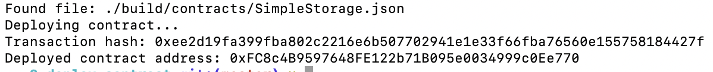

# Task 2

1. A screenshot of the console output immediately after you have successfully deployed a smart contract.

2. The transaction hash from the contract deployment (in text format)
    
   `0xee2d19fa399fba802c2216e6b507702941e1e33f66fba76560e155758184427f`

3. The deployed contract address from the contract deployment (in text format).
    
   `0xFC8c4B9597648FE122b71B095e0034999c0Ee770`
