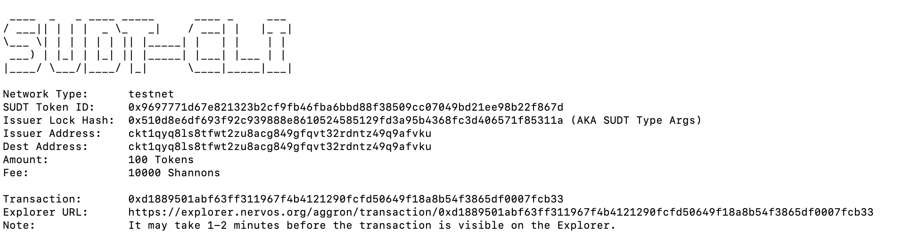
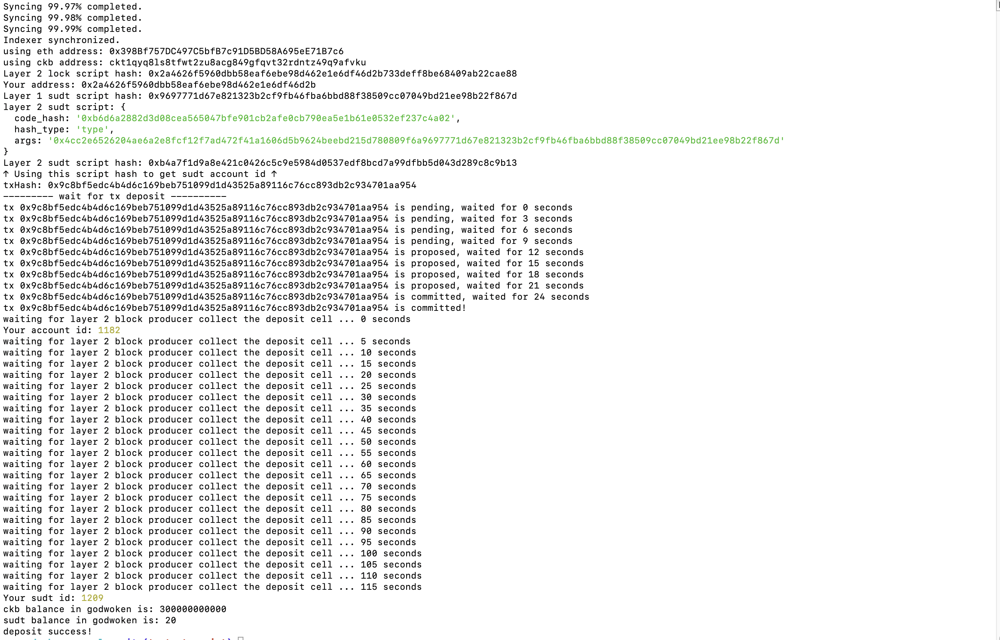

# Task 4

1. A link to the Layer 1 address you funded on the Testnet Explorer.

**https://explorer.nervos.org/aggron/address/ckt1qyq8ls8tfwt2zu8acg849gfqvt32rdntz49q9afvku**

2. A screenshot of the console output immediately after using sudt-cli to create your SUDT tokens on Layer 1.

3. A link to the transaction ID created by sudt-cli on the Testnet Explorer..

**https://explorer.nervos.org/aggron/transaction/0xd1889501abf63ff311967f4b4121290fcfd50649f18a8b54f3865df0007fcb33**

3. A screenshot of the console output immediately after you have successfully submitted a deposit to Layer 2 using the account-cli tool.

5. The SUDT ID from the console output after executing the deposit script (in text format).

`1209`
