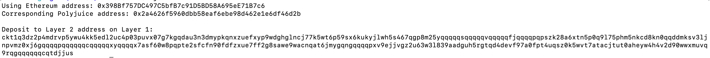

# Task 6

1. A screenshot of the console output immediately after you have successfully generated your Deposit Receiver Address.



2. Your Deposit Receiver Address (in text format).

`
ckt1q3dz2p4mdrvp5ywu4kk5edl2uc4p03puvx07g7kgqdau3n3dmypkqnxzuefxyp9wdghglncj77k5wt6p59sx6kukyjlwh5s467qgp8m25yqqqqqsqqqqqvqqqqqfjqqqqpqpszk28a6xtn5p0q9l75phm5nkcd8kn0qqddmksv3ljnpvmz0xj6gqqqqpqqqqqqcqqqqqxyqqqqx7asf60w8pqpte2sfcfn90fdfzxue7ff2g8sawe9wacnqat6jmygqngqqqqpxv9ejjvgz2u63w3l839aadguh5rgtqd4devf97a0fpt4uqsz0k5wvt7atacjtut0aheyw4h4v2d90wwxmuvq9rqgqqqqqqcqtdjjus
`

3. The Ethereum address used to generate the Deposit Receiver Address (in text format).

```
0x398Bf757DC497C5bfB7c91D5BD58A695eE71B7c6
```

4. A link to the Etherscan explorer for the successful Force Bridge transaction.

**https://rinkeby.etherscan.io/tx/0x4d0b364b73d7665499bd0280764e8b3e8ab1af26b1272689450f5fdea9023668**
<br/>
5. A link to the Nervos explorer for the successful Force bridge transaction. 
**https://explorer.nervos.org/aggron/transaction/0xc7fd7fcb327e826f57c037bd61031521fd6699e57ba1834612ce40adf7ffabe9**