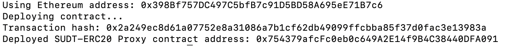
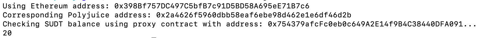

# Task 5

1. A screenshot of the console output immediately after deploying smart contract.

2. The address of the ERC20 Proxy Contract you deployed (in text format).

`0x754379afcFc0eb0c649A2E14f9B4C38440DFA091`

3. A screenshot of the console output immediately after checking your SUDT balance

4. The Ethereum address that was checked (in text format).

`0x398Bf757DC497C5bfB7c91D5BD58A695eE71B7c6`
